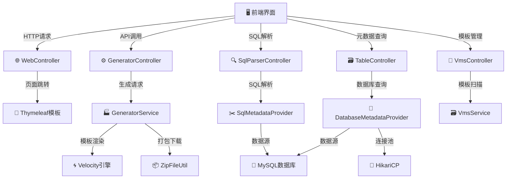
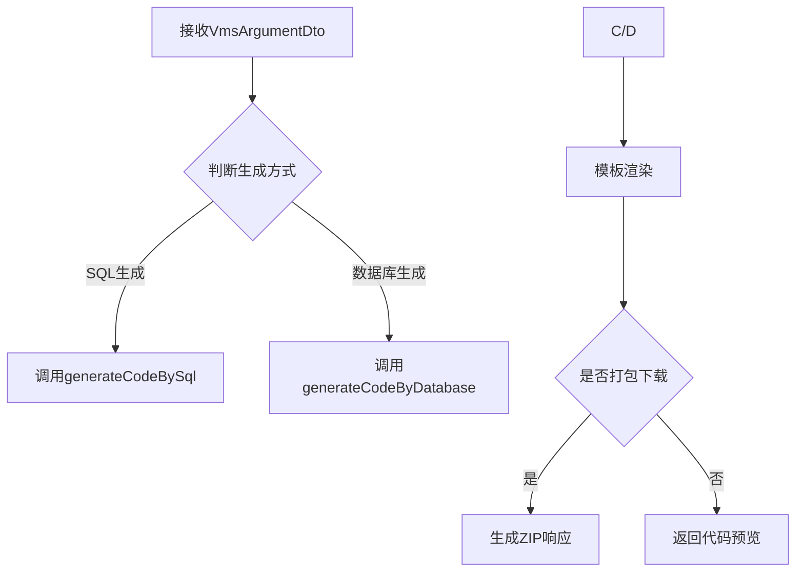
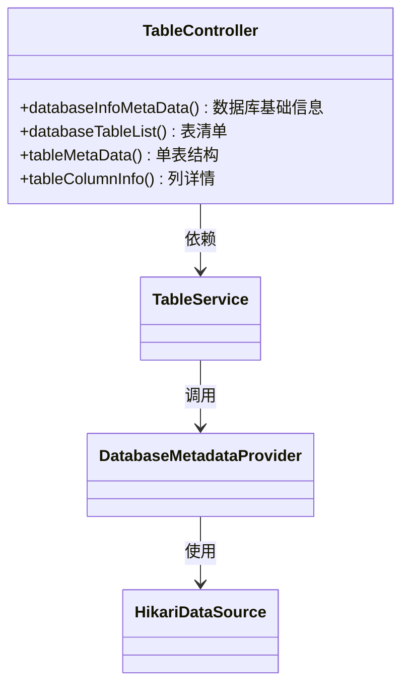
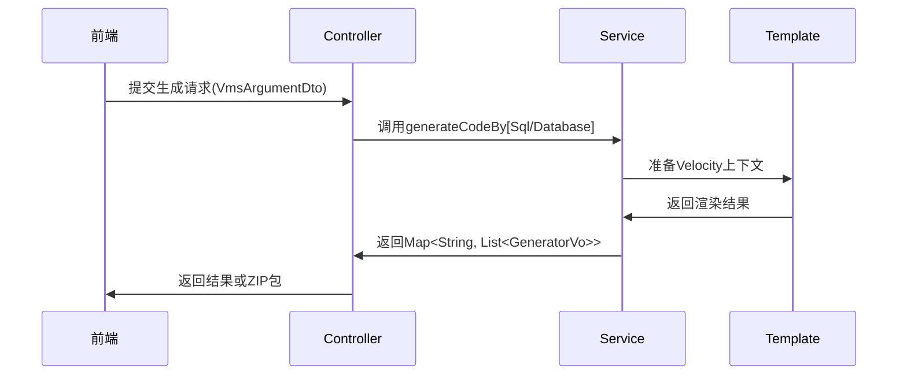
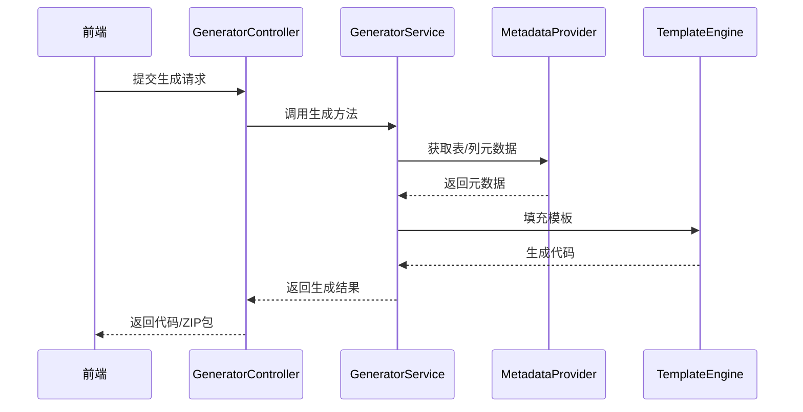
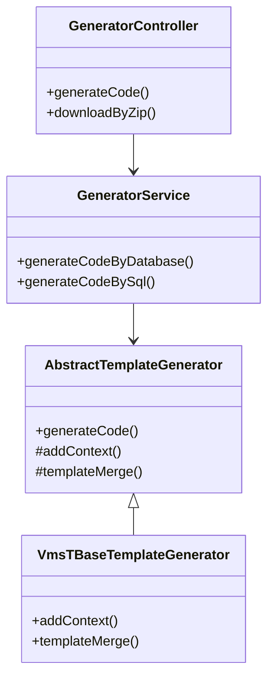
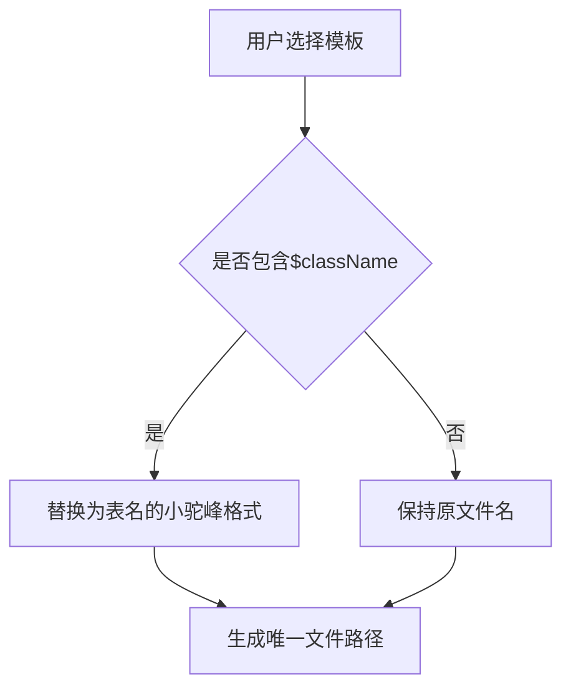

# 🚀 Bunny Code Generator 代码生成器系统文档

[](LICENSE)[]()[]()

### 📁 项目结构说明

- `src/main/java/cn/bunny/controller`：包含所有控制器
- `src/main/java/cn/bunny/core`：核心模块，包含元数据提取、数据库方言等
- `src/main/java/cn/bunny/domain`：数据模型定义
- `src/main/java/cn/bunny/exception`：异常处理模块
- `src/main/java/cn/bunny/service`：接口定义
- `src/main/java/cn/bunny/service/impl`：接口实现
- `src/main/java/cn/bunny/utils`：工具类
- `src/main/resources/static/src`：前端组件和视图
- `src/main/resources/vms`：Velocity 模板文件
- `src/main/resources/templates`：前端页面模板

## 1. 系统架构 🏗️

### 1.1 架构图



### 1.2 核心分层 🔍

| 层级         | 组件            | 技术实现             |
| ------------ | --------------- | -------------------- |
| **接入层** 🚪 | Controllers     | Spring Web, Swagger  |
| **业务层** ⚙️ | Services        | 并行流, 设计模式     |
| **核心层** 🧠 | 模板生成/元数据 | Velocity, JSqlParser |
| **数据层** 💾 | 数据源/连接池   | HikariCP, JDBC       |

---

## 2. 核心控制器详解 🎯

### 2.1 GeneratorController ⚡

#### 1. 核心控制器

- `GeneratorController`：主控制器，提供生成代码和下载ZIP文件的接口
- `TableController`：获取数据库元数据信息
- `SqlParserController`：解析SQL语句提取表和列信息
- `WebController`：页面路由控制器
- `VmsController`：获取前端代码模板路径

#### 2. 元数据解析

- `DatabaseMetadataProvider`：数据库元数据提取器
- `SqlMetadataProvider`：SQL语句元数据提取器
- `DatabaseDialect`：数据库方言接口，支持多数据库扩展
- `MySqlDialect`：MySQL方言实现，提取注释等信息

#### 3. 代码生成引擎

- `AbstractTemplateGenerator`：抽象模板生成器，定义模板方法
- `VmsTBaseTemplateGenerator`：具体模板实现，负责上下文填充和模板合并
- `ZipFileUtil`：生成ZIP文件并下载
- `MysqlTypeConvertUtil`：类型转换工具（SQL → Java/JS）

**核心业务流：**



**关键方法说明：**

1. `generator()` 方法：

   - 🔄 根据`sql`参数判断生成方式

   - 📊 使用`VmsArgumentDto`接收模板选择、包名等参数

   - 🌟 核心逻辑：

     ```java
     Strings.isEmpty(sql) 
         ? generatorService.generateCodeByDatabase(dto)
         : generatorService.generateCodeBySql(dto);
     ```

2. `downloadByZip()` 方法：

   - 🗜️ 使用`ZipFileUtil`进行内存压缩

   - ⚡ 响应头设置：

     ```java
     headers.add("Content-Disposition", "attachment; filename=" + zipFilename);
     ```

### 2.2 TableController 🗃️

**元数据查询体系：**



**典型调用链：**

1. 获取数据库信息：

   ```java
   DatabaseMetaData metaData = connection.getMetaData();
   return DatabaseInfoMetaData.builder()
       .databaseProductName(metaData.getDatabaseProductName())
       .driverVersion(metaData.getDriverVersion())
       .build();
   ```

2. 查询表结构：

   ```java
   ResultSet tables = metaData.getTables(dbName, null, "%", new String[]{"TABLE"});
   while(tables.next()){
       // 构建TableMetaData对象
   }
   ```

## 3. 关键技术实现 🔧

### 3.1 模板生成流程 🌀

**抽象模板方法模式：**

```java
public abstract class AbstractTemplateGenerator {
    // 模板方法
    public final StringWriter generateCode() {
        prepareContext();  // 准备数据
        return mergeTemplate(); // 渲染模板
    }
    protected abstract void addContext(); // 子类实现
}
```

**Velocity上下文示例：**

```java
context.put("classLowercaseName", "userInfo"); 
context.put("columns", columnList);
context.put("date", "2023-01-01");
```

### 3.2 类型转换策略 🔄

**MySQL类型映射：**

| 数据库类型 | Java类型        | 转换方法                                   |
| ---------- | --------------- | ------------------------------------------ |
| `varchar`  | `String`        | `MysqlTypeConvertUtil.convertToJavaType()` |
| `datetime` | `LocalDateTime` | 同上                                       |
| `tinyint`  | `Integer`       | 同上                                       |

**命名转换示例：**

```java
// 下划线转驼峰
convertToCamelCase("user_name", true);  // → "UserName"
convertToCamelCase("user_name", false); // → "userName"
```

## 4. 核心业务逻辑说明

### 4.1 代码生成流程

#### 4.1.1 简洁流畅



### 4.1.2 详细流程



### 4.2 关键类协作



## 5. 扩展指南 🛠️

### 5.1 添加新数据库支持

1. 实现`DatabaseDialect`接口 ✏️

2. 配置新的`IMetadataProvider` ⚙️

3. 示例代码结构：

   ```java
   @Component
   public class OracleDialect implements DatabaseDialect {
       // 实现提取注释等方法
   }
   ```

### 5.2 依赖管理 📦

**关键依赖说明：**

```xml
<!-- SQL解析 -->
<dependency>
    <groupId>com.github.jsqlparser</groupId>
    <artifactId>jsqlparser</artifactId>
    <version>4.9</version>
</dependency>

<!-- 模板引擎 -->
<dependency>
    <groupId>org.apache.velocity</groupId>
    <artifactId>velocity-engine-core</artifactId>
    <version>2.2</version>
</dependency>
```

## 6. 注意事项 ⚠️

### 6.1 性能优化点 🚀

- `parallelStream()` 用于批量生成

- `HikariCP` 配置：

  ```yaml
  hikari:
    maximum-pool-size: 20
    connection-timeout: 30000
  ```

### 6.2 版本兼容性 🔗

| 组件        | 已验证版本 |
| ----------- | ---------- |
| MySQL       | 8.0+       |
| JDK         | 17+        |
| Spring Boot | 3.4.3      |

### 6.3 文件名重复问题解决方案⚠️



**核心逻辑实现**（位于`VmsGeneratorPathHelper.java`）：

```java
public static String processVmPath(VmsArgumentDto dto, String path, String tableName) {
    String className = removeTablePrefixes(dto, tableName);
    String lowerCamelCase = MysqlTypeConvertUtil.convertToCamelCase(tableName, false);
    // 关键替换逻辑👇
    String[] pathParts = path.replace("$className", lowerCamelCase).split("/");
    ...
}
```

**必须遵守的规则**：

> [!Note]
>
> 如果不想使用`$className`可自己修改源码，进行更改。

1. 前端文件必须使用`$className`作为动态目录名（如：`web/$className/api.ts`）
2. 相同基础名称的文件必须放在不同目录下
3. Java/XML文件会自动添加类型后缀（如`UserController.java`）

### 6.4 文件命名冲突场景示例

| 错误案例                | 正确方案                   | 原因                       |
| ----------------------- | -------------------------- | -------------------------- |
| `web/index.vue`         | `web/$className/index.vue` | 多表生成时会冲突           |
| `mapper/UserMapper.xml` | 自动处理                   | 系统会自动添加表名前缀     |
| `service/Service.java`  | 自动处理                   | 会转换为`UserService.java` |

## 支持项目☕ 

如果这个项目对您有帮助，可以考虑支持我们：


**Happy Coding!** 🎉