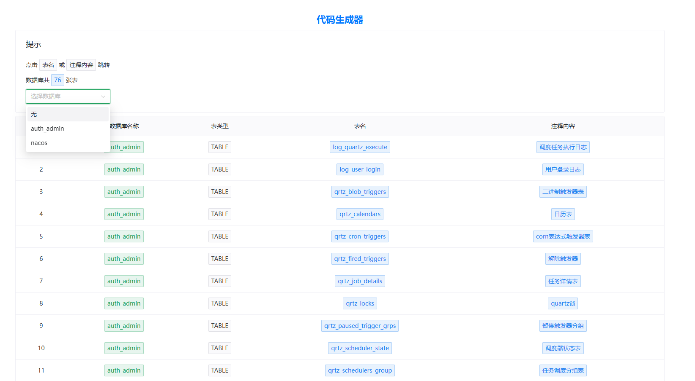
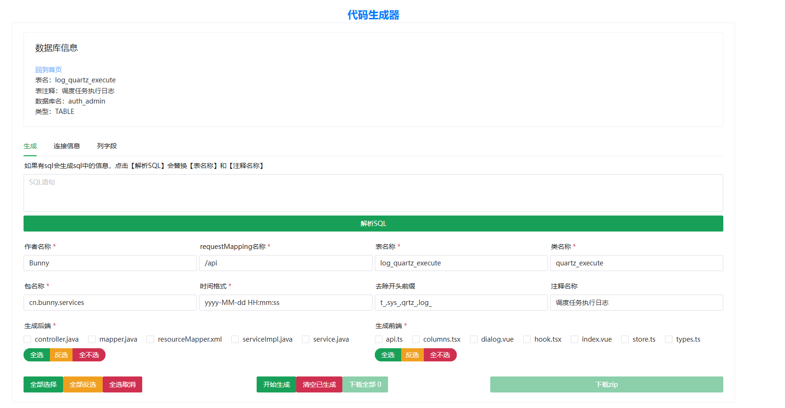
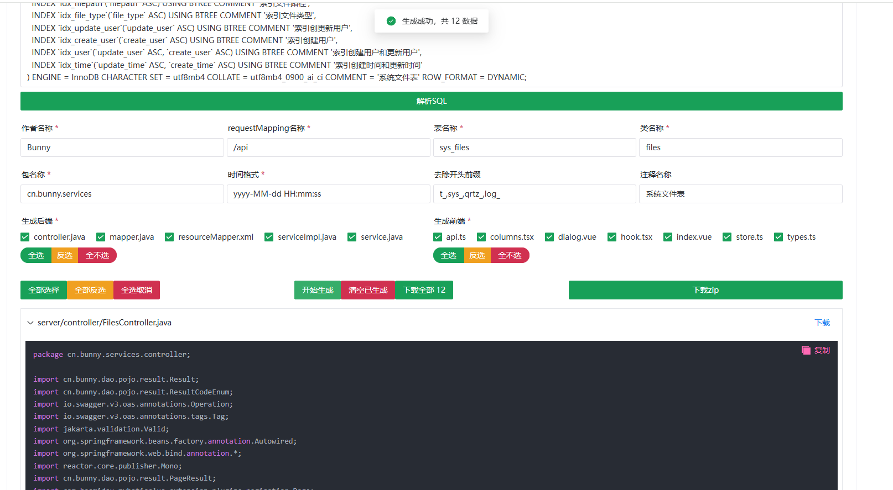

# 代码生成器

## 功能展示

点击 `表名` 或 `注释内容` 跳转到另一个页面







## 内置字段

```java
// vm 不能直接写 `{` 需要转换下
context.put("leftBrace", "{");

// 当前的表名
context.put("tableName", tableMetaData.getTableName());

// 当前表的列信息
context.put("columnInfoList", columnInfoList);

// 数据库sql列
context.put("baseColumnList", String.join(",", list));

// 当前日期
String date = new SimpleDateFormat(dto.getSimpleDateFormat()).format(new Date());
context.put("date", date);

// 作者名字
context.put("author", dto.getAuthor());

// 每个 Controller 上的请求前缀
context.put("requestMapping", dto.getRequestMapping());

// 表字段的注释内容
context.put("comment", dto.getComment());

// 设置包名称
context.put("package", dto.getPackageName());

// 将类名称转成小驼峰
String toCamelCase = TypeConvertCore.convertToCamelCase(replaceTableName);
context.put("classLowercaseName", toCamelCase);

// 将类名称转成大驼峰
String convertToCamelCase = TypeConvertCore.convertToCamelCase(replaceTableName, true);
context.put("classUppercaseName", convertToCamelCase);
```

