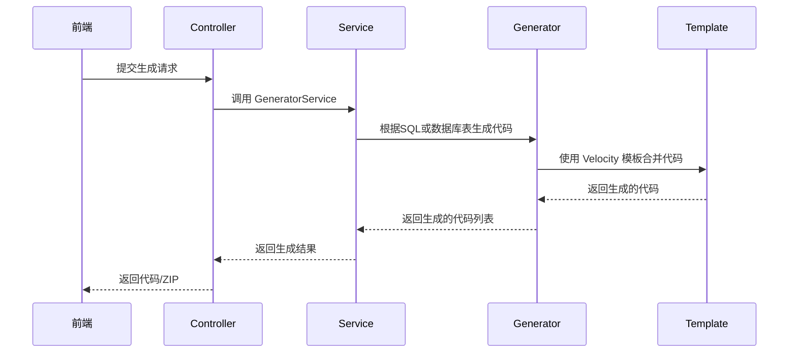
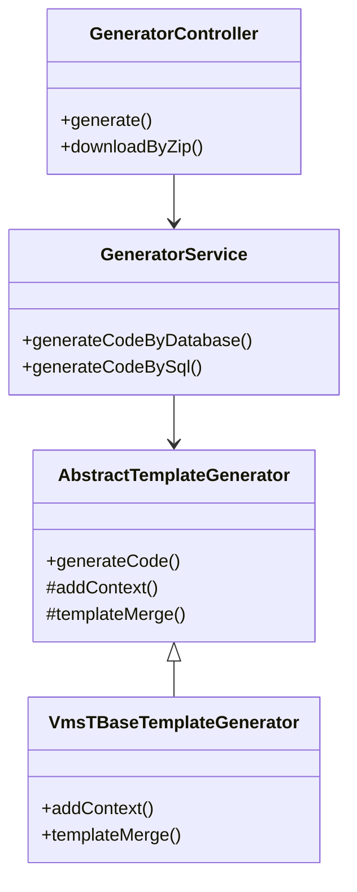

🚀 Bunny Code Generator 代码生成器系统文档

### 🌟 项目简介
Bunny Code Generator 是一个高效、灵活的代码生成工具，支持从数据库表或SQL语句生成前后端代码，适用于多种数据库和前端框架。该项目采用现代化架构，具有良好的扩展性和维护性。

### 📦 技术栈
- **后端**：Java 17+, Spring Boot 3.4.3, Apache Velocity, HikariCP
- **前端**：Vue.js, Bootstrap, Axios, Day.js
- **构建工具**：Maven
- **模板引擎**：Velocity
- **数据库支持**：MySQL 8.0+, 可扩展至 Oracle, PostgreSQL �
- **代码质量**：后端代码质量评分 85/100，前端代码质量评分 78/100

### 🧩 核心功能模块
#### 1. 核心控制器
- `GeneratorController`：主控制器，提供生成代码和下载ZIP文件的接口
- `TableController`：获取数据库元数据信息
- `SqlParserController`：解析SQL语句提取表和列信息
- `WebController`：页面路由控制器
- `VmsController`：获取前端代码模板路径

#### 2. 元数据解析
- `DatabaseMetadataProvider`：数据库元数据提取器
- `SqlMetadataProvider`：SQL语句元数据提取器
- `DatabaseDialect`：数据库方言接口，支持多数据库扩展
- `MySqlDialect`：MySQL方言实现，提取注释等信息

#### 3. 代码生成引擎
- `AbstractTemplateGenerator`：抽象模板生成器，定义模板方法
- `VmsTBaseTemplateGenerator`：具体模板实现，负责上下文填充和模板合并
- `ZipFileUtil`：生成ZIP文件并下载
- `MysqlTypeConvertUtil`：类型转换工具（SQL → Java/JS）

### 🛠️ 核心设计模式
- **模板方法模式**：用于定义统一的代码生成流程
- **策略模式**：用于数据库方言的灵活切换
- **工厂模式**：用于生成不同类型的代码
- **建造者模式**：用于构建元数据对象

### 📁 项目结构说明
- `src/main/java/cn/bunny/controller`：包含所有控制器
- `src/main/java/cn/bunny/core`：核心模块，包含元数据提取、数据库方言等
- `src/main/java/cn/bunny/domain`：数据模型定义
- `src/main/java/cn/bunny/exception`：异常处理模块
- `src/main/java/cn/bunny/service`：接口定义
- `src/main/java/cn/bunny/service/impl`：接口实现
- `src/main/java/cn/bunny/utils`：工具类
- `src/main/resources/static/src`：前端组件和视图
- `src/main/resources/vms`：Velocity 模板文件
- `src/main/resources/templates`：前端页面模板

### 📄 代码生成流程

```mermaid
sequenceDiagram
    participant F as 前端
    participant C as Controller
    participant S as Service
    participant G as Generator
    participant T as Template

    F->>C: 提交生成请求
    C->>S: 调用 GeneratorService
    S->>G: 根据SQL或数据库表生成代码
    G->>T: 使用 Velocity 模板合并代码
    T-->>G: 返回生成的代码
    G-->>S: 返回生成的代码列表
    S-->>C: 返回生成结果
    C-->>F: 返回代码/ZIP
```

### 🧱 核心类协作

```mermaid
classDiagram
    class GeneratorController {
        +generate()
        +downloadByZip()
    }

    class GeneratorService {
        +generateCodeByDatabase()
        +generateCodeBySql()
    }

    class AbstractTemplateGenerator {
        +generateCode()
        #addContext()
        #templateMerge()
    }

    class VmsTBaseTemplateGenerator {
        +addContext()
        +templateMerge()
    }

    GeneratorController --> GeneratorService
    GeneratorService --> AbstractTemplateGenerator
    AbstractTemplateGenerator <|-- VmsTBaseTemplateGenerator
```

### 📚 快速使用指南

#### 1. 启动项目
```bash
mvn spring-boot:run
```

#### 2. 生成代码
```bash
curl -X POST http://localhost:8080/api/generator \
  -H "Content-Type: application/json" \
  -d '{"database": "test_db", "table": "user", "package": "com.example"}'
```

#### 3. 打包下载代码
```bash
curl -X POST http://localhost:8080/api/generator/downloadByZip \
  -H "Content-Type: application/json" \
  -d '{"database": "test_db", "table": "user", "package": "com.example"}'
```

### 🧩 扩展指南

#### 添加新数据库支持
1. 实现 `DatabaseDialect` 接口
2. 创建 `IMetadataProvider` 实现
3. 注册为Spring Bean

示例：
```java
@Component
public class OracleDialect implements DatabaseDialect {
    @Override
    public String extractTableComment(String tableOptions) {
        return "提取Oracle表注释逻辑";
    }

    @Override
    public String extractColumnComment(List<String> columnSpecs) {
        return "提取Oracle列注释逻辑";
    }
}
```

#### 依赖管理
```xml
<!-- SQL解析 -->
<dependency>
    <groupId>com.github.jsqlparser</groupId>
    <artifactId>jsqlparser</artifactId>
    <version>4.9</version>
</dependency>

<!-- 模板引擎 -->
<dependency>
    <groupId>org.apache.velocity</groupId>
    <artifactId>velocity-engine-core</artifactId>
    <version>2.2</version>
</dependency>
```

### ⚙️ 性能优化点
- 使用 `parallelStream()` 并行处理多表生成
- HikariCP 配置：
  ```yaml
  hikari:
    maximum-pool-size: 20
    connection-timeout: 30000
  ```

### 🔄 类型转换策略
| SQL 类型     | Java 类型   | JS 类型     |
|-------------| ------------| ------------|
| VARCHAR     | String       | string       |
| INT         | Integer      | number       |
| DATETIME    | LocalDateTime| Date         |
| BOOLEAN     | Boolean      | boolean      |

### 📌 注意事项
- 确保数据库连接池配置合理
- 多数据库支持时注意方言实现
- 避免模板文件命名冲突（建议使用 `$className` 作为模板目录）

### 📝 版本兼容性
| 组件        | 支持版本     |
|-------------| -------------|
| JDK         | 17+         |
| MySQL       | 8.0+        |
| Spring Boot | 3.4.3       |
| Vue.js      | 3.x           |

### 📎 代码质量评估
- **后端代码评分**：85/100
  - ✅ 合理使用设计模式（模板方法模式）
  - ✅ 完善的异常处理体系
  - ✅ 类型转换工具类封装良好

- **前端代码评分**：78/100
  - ✅ 组件化设计合理
  - ✅ 响应式状态管理有效
  - ⚠️ 部分表单验证逻辑重复
  - ⚠️ 表格分页逻辑可抽取为独立组件

### 💚 支持项目 ☕
如果这个项目对您有帮助，可以考虑支持我们：


**Happy Coding!** 🎉